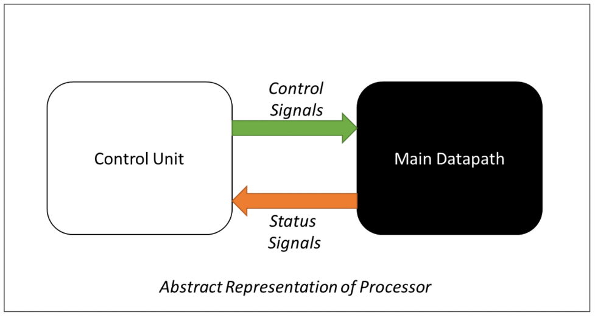
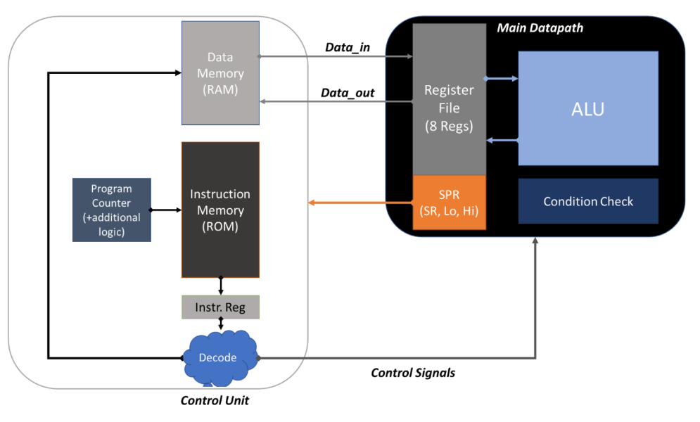

# Custom 16-Bit Harvard Processor in Verilog HDL

A custom 16-bit, Harvard-architecture processor implemented in Verilog HDL.

The processor implements a simplified MIPS-inspired instruction set with three instruction
formats (R, I, J), an 8-register register file, a combined ALU/register-file "Datapath" unit,
a ROM-based instruction memory, an 8-bit program counter, and a Status Register for
condition-flag based (conditional) execution.

--
## Table of Contents

1. [Project Background](#project-background)
2. [Architecture Overview](#architecture-overview)
3. [Instruction Set Architecture (ISA)](#instruction-set-architecture-isa)
4. [Status Register](#status-register)
5. [Conditional Instructions (Extra Credit)](#conditional-instructions-extra-credit)
6. [Repository Structure](#repository-structure)
7. [Module Documentation](#module-documentation)
8. [Sample Program Walkthrough](#sample-program-walkthrough)
9. [Known Issues & Incomplete Work](#known-issues--incomplete-work)
10. [Simulating the Design](#simulating-the-design)
11. [Suggested Roadmap](#suggested-roadmap)
12. [License](#license)

---

## Project Background

This repository implements the deliverable for the **"Design a custom 16-bit Processor using
Verilog HDL"** assignment (see [`CO Project v2.pdf`](./CO%20Project%20v2.pdf) for the original
project statement). The assignment requires designing a **Harvard-architecture** processor —
meaning instruction memory (ROM, read-only) and data memory (RAM, read/write) are kept
physically and logically separate — split into two cooperating blocks:

- **Control Unit** — fetches instructions from ROM, drives the Program Counter (PC), decodes
  instructions, and issues control signals.
- **Main Datapath** — houses the Register File (8 general-purpose 16-bit registers), the ALU,
  special-purpose registers (`Hi`, `Lo`, Status Register), and the condition-check logic that
  feeds status flags back to the Control Unit.




The processor must, at minimum, execute the **basic instruction set** (Table 2 in the spec) and,
for extra credit, support **condition-flag-gated conditional instructions** (Table 3 in the
spec) such as "add if a flag is set" and "branch if a flag is set."

---

## Architecture Overview

| Characteristic | Value |
|---|---|
| Data width | 16 bits (all registers & memory words) |
| Instruction width | 16 bits |
| Program Counter width | 8 bits (program starts at address `0x00`) |
| Register file | 8 general-purpose registers (`register[0..7]`), 16 bits each |
| Data memory | 8-word, 16-bit read/write memory (`memory[0..7]`) |
| Instruction memory | ROM, 16-bit wide, implemented as a Verilog `reg` array inside the Control Unit |
| Special-purpose registers | `Hi`, `Lo` (product of `mul`), `SR` (Status Register) |
| Architecture style | Harvard (separate instruction and data memories) |

---



## Instruction Set Architecture (ISA)

### Instruction Formats

Bit positions below are `[15:0]`, with bit 0 = LSB. All three formats share a 4-bit opcode in
bits `[3:0]` (i.e., the **low** 4 bits, not the high 4 bits — a deliberate simplification from
the classic MIPS layout mentioned in the spec).

| Type | Bits 0–3 | Bits 4–6 | Bits 7–9 | Bits 10–12 | Bits 13–15 |
|---|---|---|---|---|---|
| **R** (Register) | Opcode | `Rd` | `Rs` | `Rt` | Shift Amount |
| **I** (Immediate) | Opcode | `Rd` | `Rs` | Constant/Address (bits 10–15, 6 bits) | — |
| **J** (Jump) | Opcode | Address (bits 4–12, spread across the field) | — | — | — |

In the Verilog code (see [`Datapath.v`](./Datapath.v) and the `Datapath` module inside
[`control.v`](./control.v)) these fields are extracted combinationally as:

```verilog
opcode   = Instr[3:0];
rd       = Instr[6:4];
rs       = Instr[9:7];
rt       = Instr[12:10];
shift    = Instr[15:13];
constant = Instr[15:10];   // 6-bit immediate/constant
address  = Instr[12:4];    // 9-bit jump address (declared as reg [8:0])
```

> **Note:** the project spec's Table 1 describes the jump address as spanning bits 4–15 (12
> bits). The implementation instead declares `address` as `reg [8:0] address` and assigns it
> `Instr[12:4]` — a 9-bit field. Since the PC itself is only 8 bits wide, a 9-bit address field
> is already more than enough range; this is a simplification from the written spec rather than
> a bug, but it means jump targets in this implementation only ever use bits 4–12 of the
> instruction.

### Base Instruction Set (as implemented)

| Mnemonic | Opcode | Type | Operation | Implemented in |
|---|---|---|---|---|
| `add Rd, Rs, Rt` | `0000` | R | `Rd = Rs + Rt` | Both `Datapath.v` and `control.v` |
| `sll Rd, Rs, shamt` | `0001` | R | `Rd = Rs << shamt` | Both |
| `slr Rd, Rs, shamt` | `0010` | R | `Rd = Rs >> shamt` | Both |
| `or Rd, Rs, Rt` | `0011` | R | `Rd = Rs \| Rt` | Both |
| `and Rd, Rs, Rt` | `0100` | R | `Rd = Rs & Rt` | Both |
| `addi Rd, Rs, constant` | `0101` | I | `Rd = Rs + constant` | Both |
| `li Rd, constant` | `0110` | I | `Rd = constant` | Both |
| `lw Rd, constant(Rs)` | `0111` | I | `Rd = memory[Rs + constant]` | Both |
| `sw Rd, constant(Rs)` | `1000` | I | `memory[Rs + constant] = Rd` | Both |
| `b address` | `1001` | J | `PC = PC - address` (`Datapath.v`) / `PC = address` (`control.v`'s `Datapath`) | Both (behavior differs — see [Known Issues](#known-issues--incomplete-work)) |
| `mul Rs, Rt` | `1010` | R | `{Hi, Lo} = Rs * Rt` (32-bit product split across `Hi`/`Lo`) | Both |
| `mflo Rd` | `1011` | R | `Rd = Lo` | Both |
| `mfhi Rd` | `1100` | R | `Rd = Hi` | Both |

The two `Datapath` implementations agree on opcodes `0000`–`1100`. Differences between them are
noted below.

### Custom Extension Opcodes (only in `control.v`'s `Datapath`)

The extended `Datapath` module inside `control.v` adds two more opcodes beyond the base spec,
which appear to be a first attempt at the extra-credit conditional instructions:

| Opcode | Behavior (as coded) |
|---|---|
| `1101` | If `register[0] == 54` (`16'b0000000000110110`): `pc = address`, `Rd = address` (jump). Otherwise: `pc = PC` (fall through), `Rd = register[0]`. Used in the sample program as a hard-coded **loop-exit condition** (see [ROM[15]](#sample-program-walkthrough)). |
| `1110` | If `register[rs] < register[rt]`, sets the Negative flag in `SR`. If the Negative flag ends up set, executes `register[rd] = register[3] + register[4]` (a conditional add). Otherwise passes `Rd`/`pc` through unchanged. This is the closest analogue to the spec's `addx` (add-if-flag) instruction — specifically an **`addN`** (add-if-Negative). |

---

## Status Register

Per the project spec, the Status Register (`SR`) is a 16-bit special-purpose register where the
low 4 bits are defined as:

| Bit | Flag |
|---|---|
| 0 | Overflow |
| 1 | Carry |
| 2 | Negative |
| 3 | Zero |
| 4–15 | Unused |

**As implemented** in `control.v`'s `Datapath`, `SR` is recomputed combinationally on every
instruction (`sr = 16'b0` at the top of the `always @(Instr)` block, then conditionally
OR'd), and only a subset of the spec's flags are actually set:

- **Zero flag (bit 3, value `8`)** — set on `add`, `mul`, `or`, and `and` when `register[rs] ==
  register[rt]`.
- **Negative flag (bit 2, value `4`)** — set on `add`, `mul`, `or`, `and`, and the custom `1110`
  opcode when `register[rs] < register[rt]`.
- **A flag at bit 0 (value `1`)**, labeled "Overflow" in the bit map above, is instead set
  whenever the destination register (or the 32-bit `mul` product) equals all-ones
  (`16'hFFFF` / `32'hFFFFFFFF`) — i.e. it behaves as an *all-ones detector*, not a true
  arithmetic overflow flag.
- **Carry (bit 1)** is never set anywhere in the code.

`Datapath.v` (the standalone/basic module) does **not** implement `SR` at all — no status
signals are produced by that version.

---

## Conditional Instructions (Extra Credit)

The project spec calls for two general conditional instruction forms:

- `addx Rd, Rs, Rt` — perform `add` only if flag `x ∈ {N, Z}` is set.
- `bx label` — jump to `label` only if flag `x ∈ {N, Z, OF, C}` is set.

The current implementation does **not** yet provide a general, flag-parameterized version of
either instruction. Instead it hard-codes one specific case of each idea directly into opcode
`1110` (an `add`-if-Negative, as described above) and opcode `1101` (a jump gated on
`register[0] == 54`, rather than on an `SR` flag). Generalizing these into true `addz`/`addn`
and `bz`/`bn`/`bc`/`bof` opcodes (with their own opcode encodings and flag-selection bits) is
the main piece of unfinished work for full extra-credit compliance — see
[Suggested Roadmap](#suggested-roadmap).

---

## Repository Structure

| File | Description |
|---|---|
| [`CO Project v2.pdf`](./CO%20Project%20v2.pdf) | Original assignment/project statement handed out by the course instructor. Source of truth for the ISA and grading rubric. |
| [`Datapath.v`](./Datapath.v) | Standalone `Datapath` module: register file + ALU combined, no Status Register, no conditional opcodes. The "basic" datapath. |
| [`control.v`](./control.v) | The **Control Unit** (`module Control`) plus a **second, extended** `Datapath` module (with `SR`, `Hi`/`Lo`, and the custom conditional opcodes `1101`/`1110`). Also embeds the sample program directly in the instruction ROM. |
| [`ROM.v`](./ROM.v) | An early, incomplete draft of a ROM/control sketch. Not currently valid, compilable Verilog (see [Known Issues](#known-issues--incomplete-work)). Kept for historical reference. |
| [`full adder.v`](./full%20adder.v) | A `half_adder` module (complete) and the start of a `full_adder` module (incomplete — declaration only, no body). Appears intended as a building block for a structural/gate-level ALU adder with carry propagation, but was never finished; the current ALU instead uses Verilog's built-in `+` operator. |

---

## Module Documentation

### `Datapath.v` — Basic Datapath

```verilog
module Datapath (Instr, Rd, PC, pc);
```

- **Inputs:** `Instr` (16-bit instruction), `PC` (8-bit program counter in).
- **Outputs:** `Rd` (16-bit ALU/result output), `pc` (8-bit program counter out).
- Internally declares the register file (`register[0:7]`), a small data memory
  (`memory[0:7]`), and `hi`/`lo`/`sr` registers (the latter unused in this file — `sr` is
  declared but never written).
- Combinational `always @(Instr)` block: decodes `opcode` and executes one of opcodes
  `0000`–`1100`, `0111`, `1000`, or `1001` (jump, implemented as `pc = PC - address`, i.e. a
  **backward-relative** branch — see below).
- No Status Register logic; purely functional execution of the base instruction set.

### `control.v` — Control Unit + Extended Datapath

This file contains **two** modules:

#### 1. `module Control (clk, rst, data_in, PC, pc, Instr, Rd, sr)`

- Instantiates the extended `Datapath` (`D1`) declared later in the same file.
- Holds the 17-entry instruction ROM (`reg [15:0] ROM [0:16]`) — see
  [Sample Program Walkthrough](#sample-program-walkthrough) for its contents.
- `initial` block seeds `R` and `PC` from `data_in` after a `#100` delay (simulation-only
  initialization).
- A clocked `always @(posedge clk, posedge rst, negedge rst)` block:
  - Resets `R` to 0 when `rst == 1`.
  - Otherwise free-runs `R = R + 1` every clock edge (both `posedge` and `negedge` triggering
    is not standard synthesizable practice — see [Known Issues](#known-issues--incomplete-work)).
  - Sets `PC = R` regardless of whether `clk` is `0` or `1` (both branches do the same thing).
- A second, purely combinational `always @(PC)` block re-declares the entire ROM contents
  every time `PC` changes, then does `Instr = ROM[PC]`. It also contains a loop-restart
  mechanism: when `R == 17` or `pc == 17`, it resets `R`/`PC`/`Instr` back to whatever the
  datapath's `pc` output currently holds (effectively "wrap the PC back to the branch
  target once the fixed 17-entry program has been fully scanned").

#### 2. `module Datapath (Instr, PC, Rd, sr, pc)` (extended)

- Same core opcode handling as `Datapath.v`, plus:
  - `Hi`/`Lo` are real 16-bit halves of a `reg [31:0] multiple` product register for `mul`.
  - Full Status Register (`sr`) computation described in [Status Register](#status-register).
  - The two custom conditional opcodes `1101` and `1110` (see
    [Conditional Instructions](#conditional-instructions-extra-credit)).
  - The jump opcode `1001` here does `pc = address` (an **absolute** jump), which differs from
    `Datapath.v`'s relative `pc = PC - address`.

> **Compilation note:** because both `Datapath.v` and `control.v` each declare a module named
> `Datapath`, compiling both files together in the same Verilog project will fail with a
> duplicate-module-definition error. Pick one `Datapath` implementation (the extended one in
> `control.v` is the more complete/current version) when building or simulating.

### `ROM.v` — Early Draft (Incomplete)

An early sketch of a combined ROM/control block. As it stands, it is **not valid Verilog**:

- The module header `module Control (clk,rst,op,A,B)` is missing its closing `)` / `;` and an
  input port list declaration.
- `ROM[0] = 000000000000000;` and similar lines appear directly inside the module body, outside
  of any procedural (`initial`/`always`) block or continuous (`assign`) statement — array
  element assignment like this is not legal outside a procedural block in Verilog.
- Most `ROM[n] = ...;` lines have no right-hand value at all.
- References `out` and `OP1` that are never declared.
- No `endmodule`.

This file predates `control.v` and appears to be superseded by it. It is kept in the repo for
history but should not be included in a build.

### `full adder.v` — Half Adder (complete) + Full Adder (incomplete)

```verilog
module half_adder(A,B,S,C);
```

- Fully implemented 1-bit half adder: `S = A ^ B`, `C = A & B`.

```verilog
module full_adder(
```

- Declaration only — no port list, no body, no `endmodule`. Intended (based on the module name
  and its pairing with `half_adder`) to build a ripple-carry adder for proper carry/overflow
  detection in the ALU, feeding the `Carry`/`Overflow` bits of the Status Register that are
  currently unimplemented. Never completed.

---

## Sample Program Walkthrough

`control.v` hard-codes a 17-instruction demo program directly into the ROM (`ROM[0]` through
`ROM[16]`), exercising most of the instruction set:

| Addr | Encoding (binary) | Meaning |
|---|---|---|
| 0 | `0000100000000110` | `li R0, 2` — R0 = 2 |
| 1 | `0000110000010110` | `li R1, 3` — R1 = 3 |
| 2 | `0000000010100000` | `add R2, R1, R0` — R2 = R1 + R0 |
| 3 | `0100000010110001` | `sll R3, R1, 2` — R3 = R1 << 2 |
| 4 | `0100000011000010` | `slr R4, R1, 2` — R4 = R1 >> 2 |
| 5 | `0000000011011010` | `mul R1, R0` — {Hi, Lo} = R1 × R0 |
| 6 | `0000000011011011` | `mflo R5` — R5 = Lo |
| 7 | `0000000011111100` | `mfhi R7` — R7 = Hi |
| 8 | `0000000010100011` | `or R2, R1, R0` — R2 = R1 \| R0 |
| 9 | `0000000010100100` | `and R2, R1, R0` — R2 = R1 & R0 |
| 10 | `0000110010100101` | `addi R2, R1, 3` — R2 = R1 + 3 |
| 11 | `0000110001100110` | `li R6, 3` |
| 12 | `0000110011011000` | `sw R5, 3(R1)` — memory[R1 + 3] = R5 |
| 13 | `0000000010101110` | Custom `1110`: R2 = R3 + R4 if R1 < R0 |
| 14 | `0000110010000111` | `lw R0, 3(R1)` — R0 = memory[R1 + 3] |
| 15 | `0000000100011101` | Custom `1101`: exit/loop-branch if R0 == 54 |
| 16 | `0000000000111001` | `b address(3)` — jump |

This program is a straight-line exercise of arithmetic, logic, shifts, multiply, memory
load/store, and the two conditional opcodes — useful as a smoke test once the design is wired
up in a simulator, but it is not parameterized (there's no separate assembler — instructions
are written directly as 16-bit literals with explanatory comments).

---

## Known Issues & Incomplete Work

This is an in-progress student project; the following gaps and quirks are worth knowing before
building on top of it:

1. **`ROM.v` does not compile** — see [above](#romv--early-draft-incomplete). Superseded by the
   ROM embedded in `control.v`.
2. **`full adder.v`'s `full_adder` module is unfinished** — only the module keyword and name are
   present. The ALU currently relies on Verilog's built-in `+`/`-` operators instead of a
   structural adder, so `full_adder`/`half_adder` are not actually wired into the datapath yet.
3. **Duplicate `Datapath` module name** — `Datapath.v` and `control.v` each define a module
   called `Datapath` with different port lists and behavior. Only one can be compiled into a
   given simulation at a time.
4. **Jump semantics differ between the two `Datapath` variants** — `Datapath.v` does
   `pc = PC - address` (relative backward jump); `control.v`'s `Datapath` does `pc = address`
   (absolute jump). Pick/standardize one.
5. **Status Register is only partially implemented** — Carry is never set, and the bit
   documented as "Overflow" is actually an all-ones detector rather than true signed-overflow
   detection (no `full_adder`-based carry-out is available to compute it correctly).
6. **Conditional instructions are hard-coded special cases**, not the general, flag-selectable
   `addx`/`bx` forms described in the spec (see
   [Conditional Instructions](#conditional-instructions-extra-credit)).
7. **Clocking in `Control`'s sequential block is non-standard**: the sensitivity list
   `always @(posedge clk, posedge rst, negedge rst)` triggers on both edges of `rst`
   simultaneously with `posedge clk`, and inside the block `PC = R` is assigned identically
   whether `clk` is high or low — meaning `clk` doesn't currently gate anything. `R` free-runs
   as an unconditional counter once out of reset. This will simulate, but does not represent
   clean synchronous design practice and should be revisited.
8. **No testbench files** are present in the repository. All verification so far appears to
   have been done by manual inspection/waveform tracing of the sample program in `control.v`.
9. **No build/simulation scripts** (Makefile, `.do` file, etc.) are included.

---

## Simulating the Design

The project was developed for a Verilog simulator/synthesis flow such as **Xilinx ISE/Vivado**
or **ModelSim** (typical for a Computer Organization lab), but it can also be exercised with the
open-source **[Icarus Verilog](http://iverilog.icarus.com/)** toolchain. Given the duplicate
`Datapath` module issue above, compile `control.v` on its own (it contains the more complete
`Control` + `Datapath` pair) rather than combining it with `Datapath.v`:

```bash
# Compile the Control Unit + extended Datapath together
iverilog -o sim.out control.v

# Run the compiled simulation
vvp sim.out
```

Because there is no bundled testbench, you will need to write one that drives `clk`/`rst` and
observes `Instr`, `Rd`, `sr`, and `pc` to watch the sample program (see
[Sample Program Walkthrough](#sample-program-walkthrough)) execute.

To try the standalone basic datapath instead (no Control Unit, no Status Register, no
conditional opcodes), compile `Datapath.v` in isolation with your own testbench driving
`Instr`/`PC` directly.

---

## Suggested Roadmap

For anyone picking this project back up (e.g., ahead of a viva/demo or a follow-on course):

1. **Finish `full_adder`** in `full adder.v` and use a chain of `full_adder`s (or a documented
   equivalent) to derive proper Carry-out and signed-Overflow flags for `SR`, replacing the
   current all-ones heuristic.
2. **Resolve the duplicate `Datapath` module** — delete or merge `Datapath.v` into a single
   canonical datapath (recommend keeping the `SR`-aware version from `control.v` and deleting or
   renaming the basic one, or merging any Datapath.v-only behavior you want to keep).
3. **Delete or rewrite `ROM.v`** — either remove the file or replace it with a clean,
   compilable version now that `control.v` has a working ROM.
4. **Generalize the conditional instructions** into real `addz`/`addn` and `bz`/`bn`/`bc`/`bof`
   opcodes with a flag-select field, per Table 3 of the spec, instead of the current two
   hard-coded special cases.
5. **Clean up the Control Unit's clocking** so `clk` actually gates PC/instruction updates in a
   standard synchronous style, and add a proper reset flow.
6. **Add a testbench** (`tb_control.v` / `tb_datapath.v`) with self-checking assertions for each
   opcode, plus a regression run of the sample program with expected register/memory/SR values
   at each step.
7. **Add a small assembler or instruction-encoding helper** so future test programs don't need
   to be hand-encoded as 16-bit binary literals.

---

## License

No license file is currently included in this repository. All rights reserved by the authors
unless/until a license is added.
